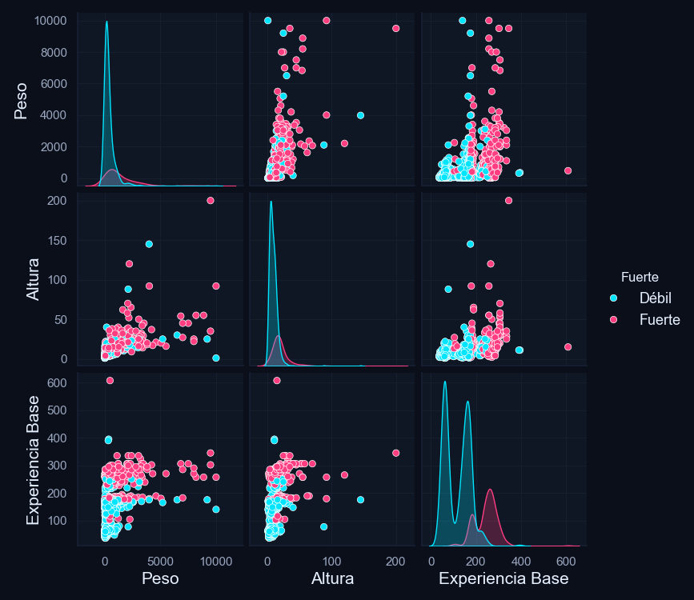
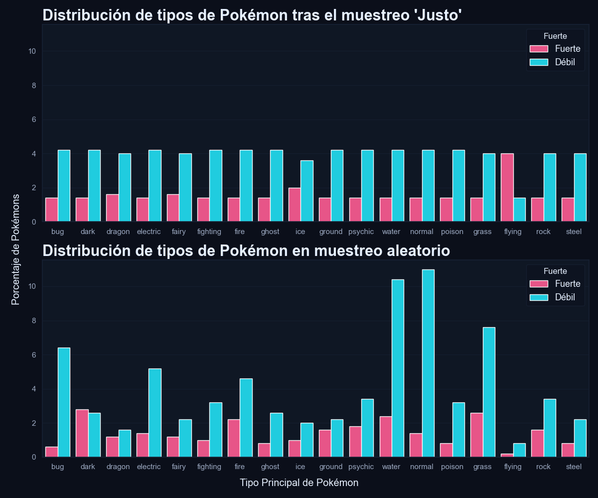
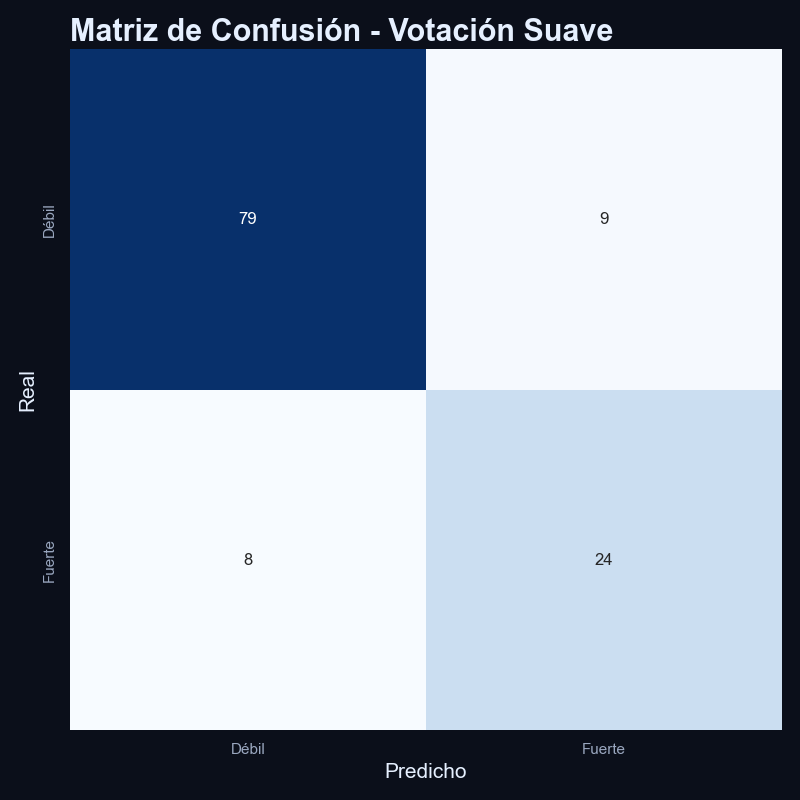
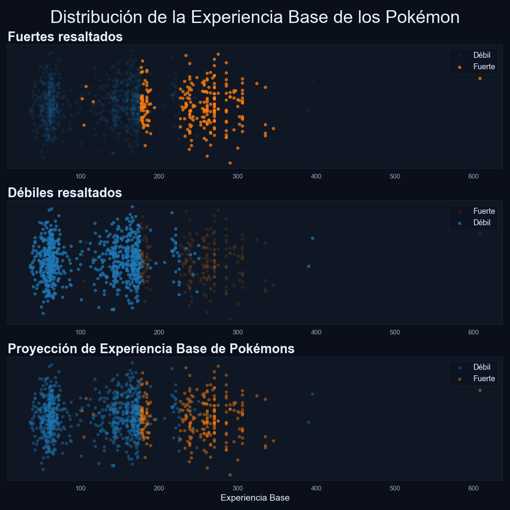
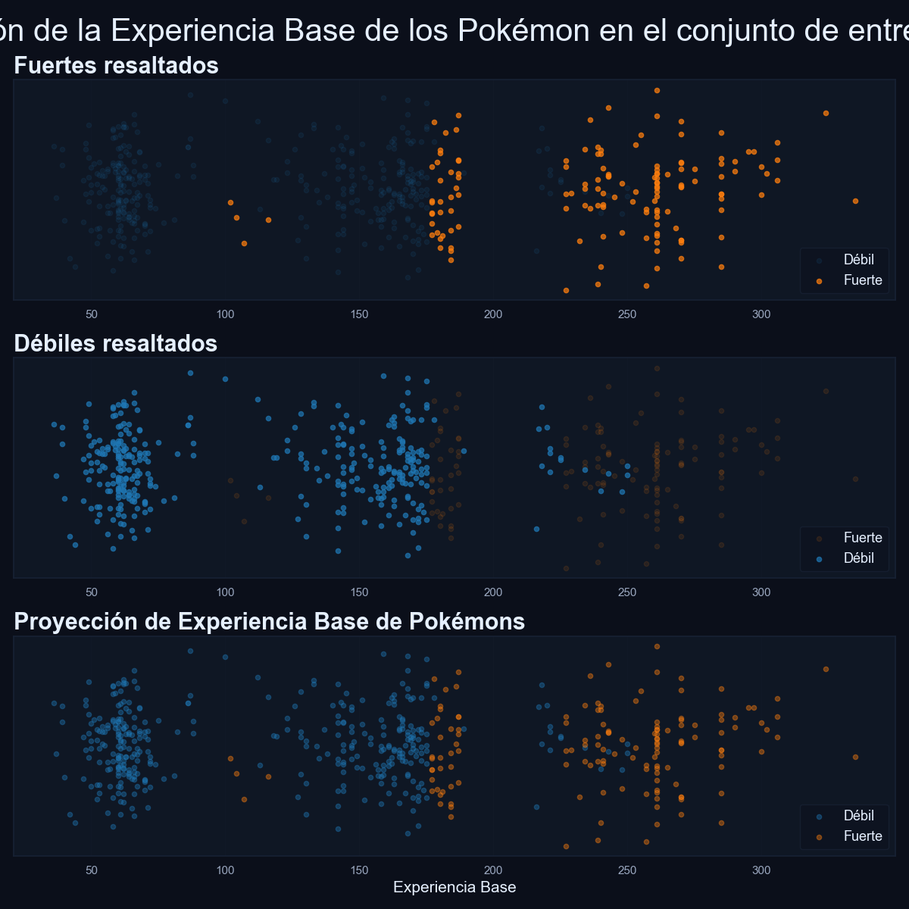
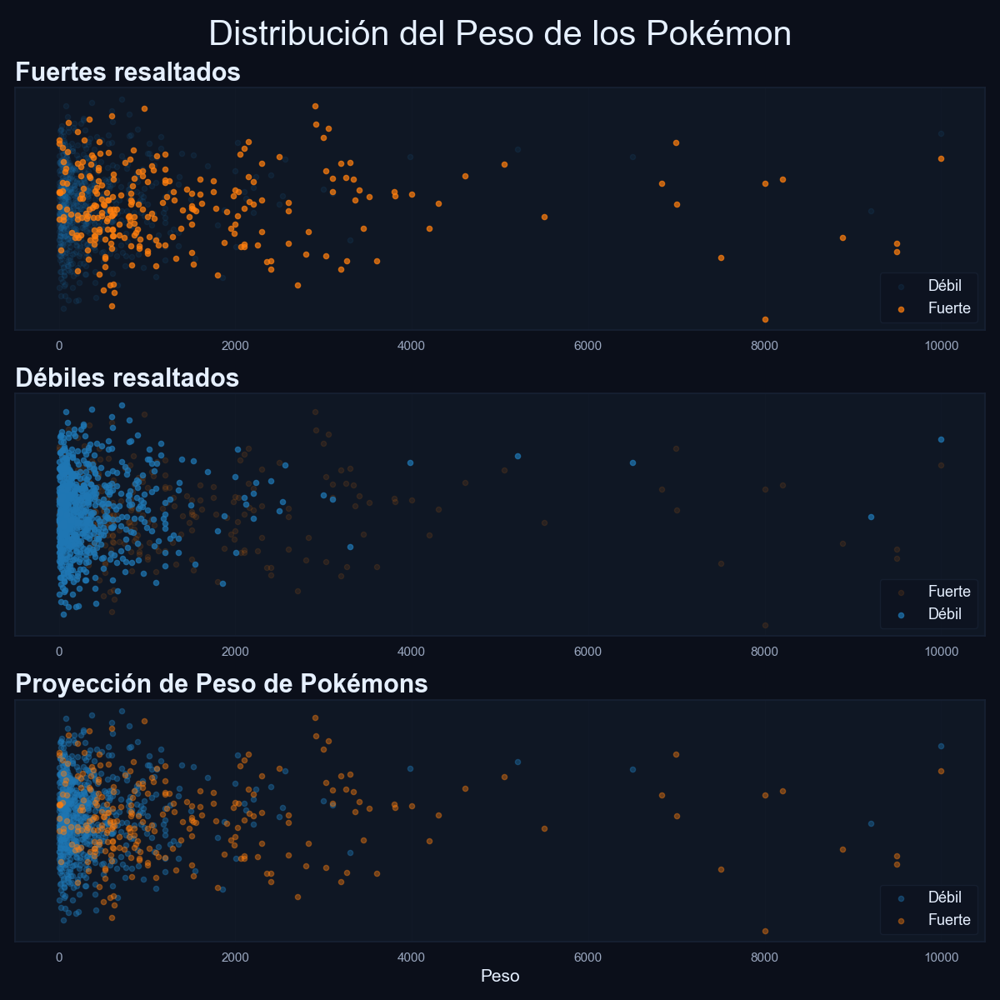
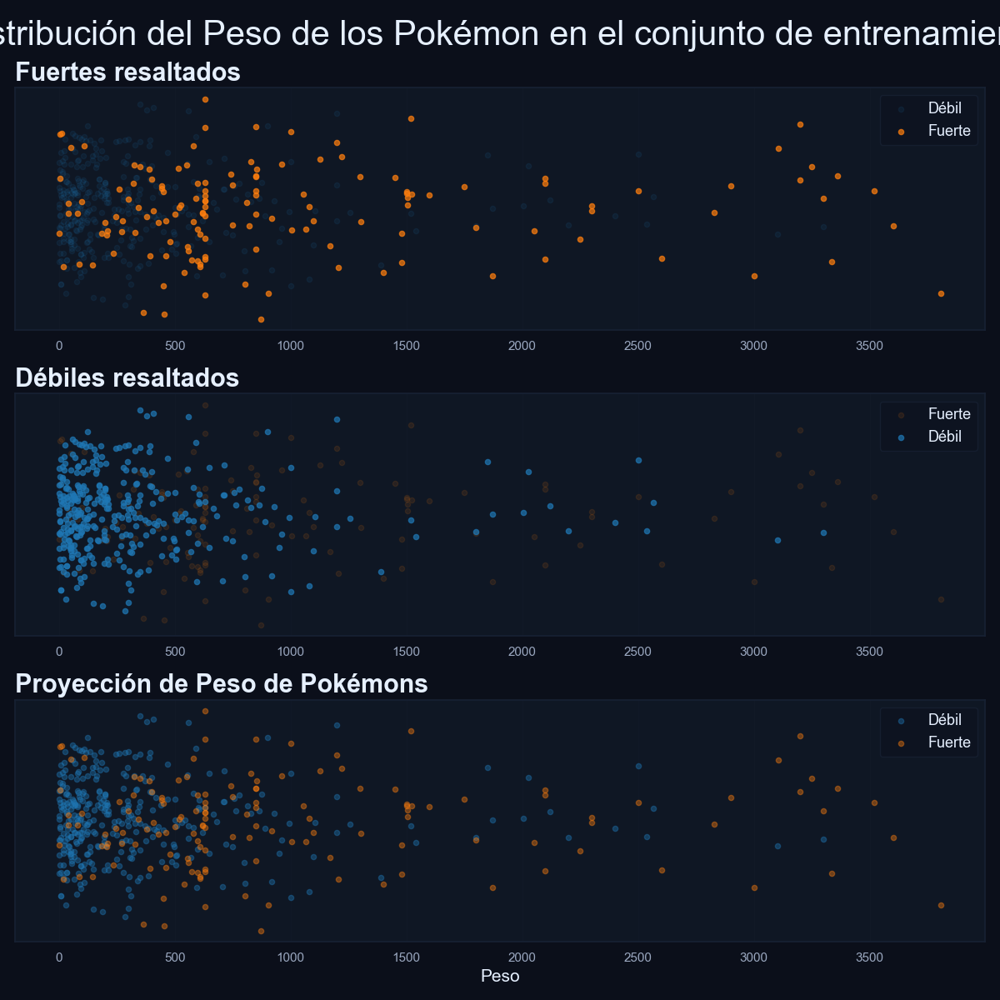
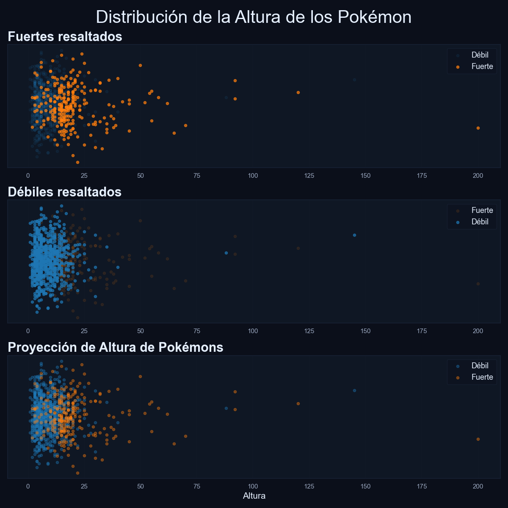
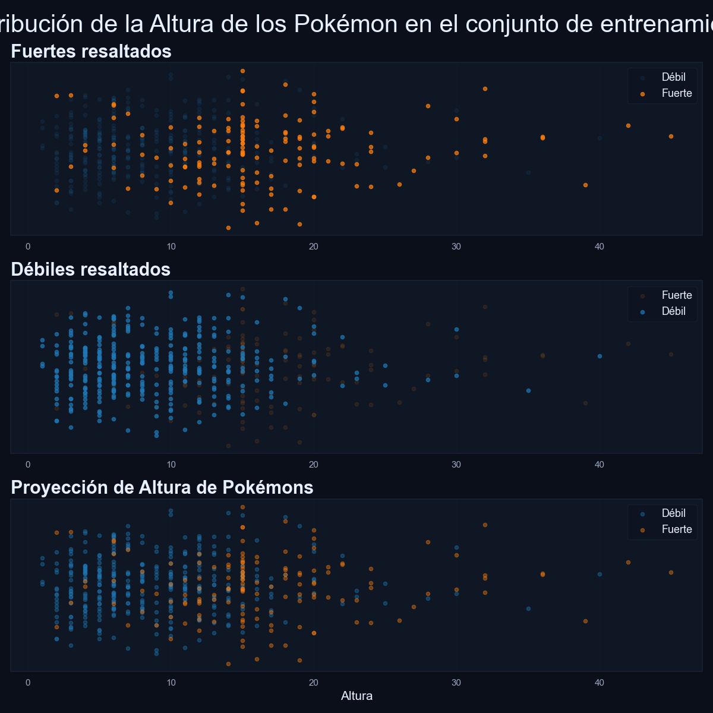

# 🧪 Predicción de “Fortaleza” Pokémon — resumen del notebook

## 🎯 Objetivo del notebook
Predecir si un Pokémon es **Fuerte** o **Débil** usando cuatro columnas del dataset:
- **Experiencia Base** (la que mejor separa las clases)
- **Peso** (tiene colas largas, hay que tratarlo)
- **Altura** (aporta poco por sí sola)
- **Tipo Principal** (categórica)

---

## 🧭 Pasos Generales
1. **EDA**: distribuciones, relaciones entre variables y diferencias por clase.  
2. **Muestreo “Justo” por Tipo**: equilibra los tipos sin deformar demasiado la población
3. **Partición estratificada**: cuida que el *train* cubra colas/rangos útiles (especialmente en Experiencia Base y Peso).  
4. **Modelo**: ensamble sencillo (LR / SVC / KNN / NB) con **votación suave** usando.
5. **Evaluación**: matriz de confusión y métricas básicas.

---

## 🖼️ Figuras

### 1) Pairplot: Peso–Altura–Experiencia por clase
  
**Qué mirar**: las curvas KDE dejan claro que **Experiencia Base** separa mejor *Fuerte* vs *Débil*. **Peso**,**Altura** tiene una baja capacidad de discriminar.

---

### 2) Muestreo “Justo” vs aleatorio por Tipo
  
**Qué mirar**: arriba, las barras quedan **más parecidas entre tipos** tras el muestreo Justo; abajo, el aleatorio refleja el sesgo poblacional (water/normal/grass dominan). Sirve para entrenar sin que los tipos raros se pierdan.

---

### 3) Matriz de confusión (ensamble)
  
**Qué mirar**: desempeño equilibrado. Con los valores del gráfico se obtiene aprox.:  
**Accuracy 0.859 · Precision 0.727 · Recall 0.750 · F1 0.739**.

---

### 4) Distribuciones globales y del *train*

**Experiencia Base**  
- Población:   
  *Fuerte* se concentra en valores más altos (bandas ~200–300).  
- Train:   
  No se elimino el patrón general, a pesar del muestro 'justo'

**Peso**  
- Población:   
  Colas largas para la clase tipo 'Fuerte'
- Train:   
  Limpieza de outliers

**Altura**  
- Población:   
  Característica poco discriminante.
- Train:   
  Se mantuvo la forma de la población.

## 🧪 Resultado
El ensamble funciona **bien de inicio**, pues no parece haber un desbalance marcado entre Precision y recall.

---

## 📂 Dónde está todo
- Notebook principal: `nb_template.ipynb`  
- Imágenes: `./figures/*.png` (todas las de arriba)

